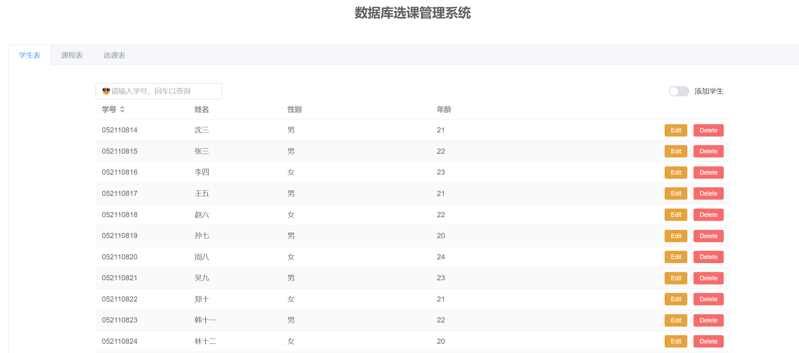
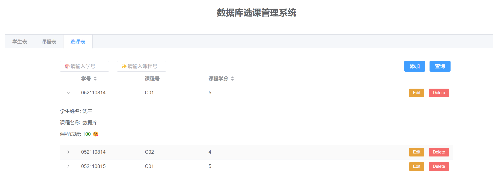

> [!IMPORTANT]
> 😎**如何开始**

💕首先确保你有一个 Oracle 数据库，并且在 windows(linux 未测试) 的环境变量中设置如下参数:

| 环境变量       | Python 变量名      |
|:--------------:|:------------------:|
| `ORACLE_USER`   | `username`(例如，`syz`)         |
| `ORACLE_PASSWORD` | `password`(例如，`123`)        |
| `ORACLE_HOST`   | `host`(例如，`localhost`)             |
| `ORACLE_PORT`   | `port`(例如，`xxxx`)             |
| `ORACLE_DB`     | `service_name`(例如，`xepdb1`)     |

<br/>

💕其次，你需要准备一个 Python 虚拟环境以及安装必要的依赖
```bash
pip install -r requirements.txt
```

😊在根目录 `/sc-sql/` 运行：
```bash
cd back
python -m app
```
即可享受这个小项目。

<br/>
<br/>
<br/>


> [!TIP]
> 😶‍🌫️**我做了什么**

利用 vue3 + Flask + Oracle 做了一个简单的关于学生选课的信息**管理**系统.

<br/>
<br/>

> [!WARNING]
> DEMO

您可以通过欣赏一些 DEMO，决定是否要使用该项目：

[](https://imgsli.com/MjczMjM2)
[](./pics/p5.png)
